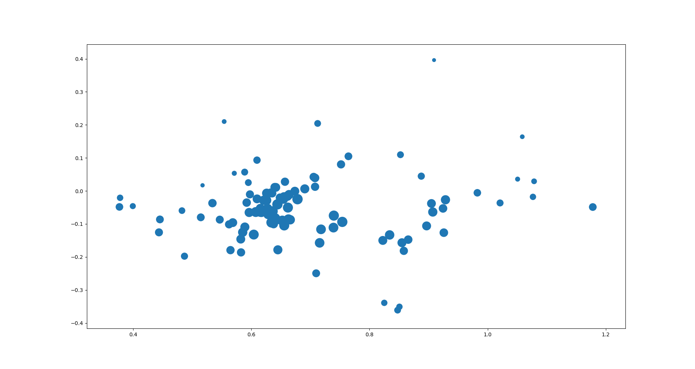
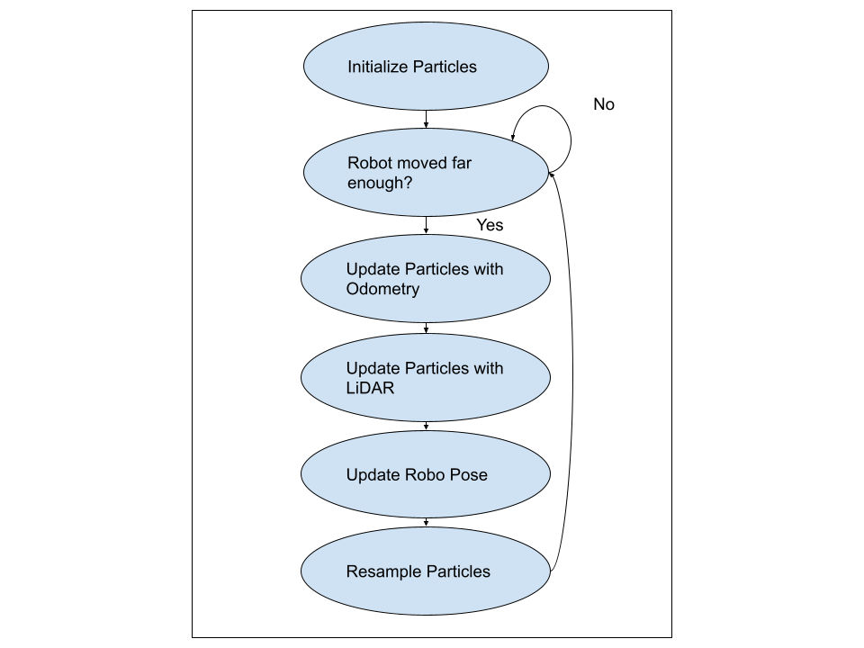

# Computational Robotics Localization

You should include a couple of bag files of your code in action. Place the bag files in a subdirectory of your ROS package called “bags”. In this folder, create a README file that explains each of the bag files (how they were collected, what you take from the results, etc.).

Writeup (Due 10-12)

In your ROS package create a README.md file to hold your project writeup. Your writeup should touch on the following topics. We expect this writeup to be done in such a way that you are proud to include it as part of your professional portfolio. As such, please make sure to write the report so that it is understandable to an external audience. Make sure to add pictures to your report, links to Youtube videos, embedded animated Gifs (these can be recorded with the tool peek).

# Running the Code
## Gauntlet Gazebo
1. In terminal run rviz with a certain config file `rviz2 -d ~/ros2_ws/src/robot_localization/rviz/turtlebot_bag_files.rviz`
2. In a separate terminal run the gazebo `ros2 launch neato2_gazebo neato_gauntlet_world.py`
3. In another terminal run the particle filter `ros2 launch robot_localization test_pf.py map_yaml:=/home/mitzi/ros2_ws/src/neato_localization/maps/gauntlet.yaml`
## MAC floor localization
1. In terminal run rviz with a certain config file `rviz2 -d ~/ros2_ws/src/robot_localization/rviz/turtlebot_bag_files.rviz`
2. In a separate terminal run the particle filter `ros2 launch robot_localization test_pf.py map_yaml:=path-to-your-yaml-file`
3. In a another terminal run `ros2 bag play path-to-your-bag-file` to play the bag file
# Goals
Our goals for this project were the following:
- Use the starter code to implement a clean example of a particle filter
- Be cautious of computational cost and think of ways to optimize for speed
- Think of the possible applications this algorithm could have in our research

# How did you solve the problem? 
How did you solve the problem? (Note: this doesn’t have to be super-detailed, you should try to explain what you did at a high-level so that others in the class could reasonably understand what you did).

# How did you solve the problem?
How did you solve the problem? (Note: this doesn’t have to be super-detailed, you should try to explain what you did at a high-level so that others in the class could reasonably understand what you did).

The basic code architecture was initializing particles, moving them with respect to the robot's obometring and then adjusting the particle based on the laser scan, updating the robot pose in the global coordinate frame, then resampling the particles.
    First we initialize a set number of particles around the map. Then we checked if the robot had moved a set distance, if the robot had then the particles would be moved according to the robots movement. We then used the LiDAR data from the robot to determine the weights of the particles which is how accurately the particle's position aligns with the data received from the LiDAR. Then we took the particle with the highest weight and chose that particle to be where the robot thought it was in the global frame. We then resampled the particles which meant that we redistributed particles with lower weights to the locations of particles with higher weights. This was the conclusion of the loop and we then would check if the robot had moved far enough to run the loop again.

# Design Decision
The largest design decision we faced was deciding how we wanted to handle our reference frames and the relationships between them. There are two main options here that ultimately achieve the same goal: using basic trig functions to establish relationships between coordinates and their frames or take it a step further and implement translation and rotation matrices.

We ultimately decided that the matrix approach would be the best way to go. This is mostly a “future proofing” decision. While right now it may seem like hitting a needle with a sledge hammer, if we were to move into the three dimensional space with our robot it would become a necessity.

$$inv(\begin{bmatrix} cos(theta_1) & -sin(theta_1) & X_1 \\ sin(theta_1) & cos(theta_1) & Y_1 \\ 0 & 0 & 1 \end{bmatrix}) \begin{bmatrix} cos(theta_2) & -sin(theta_2) & X_2 \\ sin(theta_2) & cos(theta_2) & Y_2 \\ 0 & 0 & 1 \end{bmatrix} \begin{bmatrix} cos(theta_p) & -sin(theta_p) & X_p \\ sin(theta_p) & cos(theta_p) & Y_p \\ 0 & 0 & 1 \end{bmatrix}$$ 
Where subscript 1 is the reference frame of the robots old position, subscript 2 is the reference frame of the robots current position, and p is the reference frame of the particle.

Another important decision we made was how to distribute particles when the filter is initialized. We decided that the best way to do this would be to evenly distribute particles around our initial location in an equalized grid form. 

This allows for an easy distribution that we know will be resistant to possible biases or inconsistencies that you could possibly see in a random initialization. 

# Challenges
What if any challenges did you face along the way?
One of our biggest challenges was how to debug sections of our code at a time. Print based debugging was often difficult since there was so much data printing. We solved this challenge by creating visualizations in matplotlib and using the debugger in VScode to step by step walk through how the code was executing and what the values of variables were.
Another challenge was having many terminal windows up simuatusly and determining what was currently running.
Another challenge was trying to get Rviz2 to function properly which required constantly saving a config file.
# Improve if we had more time
What would you do to improve your project if you had more time?
* We would try out initializing more particles and intialiign the particles not based around the robots position.
* We would also be interested in ways to optimize the run time of our code to get it to update the position of the robot in the global frame faster.
* We would be interested in trying out different hard coded parameters such as the number we use to determine how well a particle matches the LiDAR scan or another parameter of how far the robot has to go for the code to update the particles.
* We would also like to try running our particle filter on the actual Neatos around the MAC

# Interesting lessons
Did you learn any interesting lessons for future robotic programming projects? These could relate to working on robotics projects in teams, working on more open-ended (and longer term) problems, or any other relevant topic.
* Visualize sooner rather than later to confirm that the lower level code works before building on it.
* Test all new code to confirm it works before moving on to writing more code.

# Bag file explanation
## Gauntlet simulation 1
Gauntlet simulation 1 located at bags/Gauntlet_sim_1 is a bag file collected in Gazebo while the Neato is controlled through teleop and is localized.
## Gauntlet simulation 2
Gauntlet simulation 2 located at bags/Gauntlet_sim_2 is a bag file collected in Gazebo while the Neato is controlled through teleop and is localized.
 